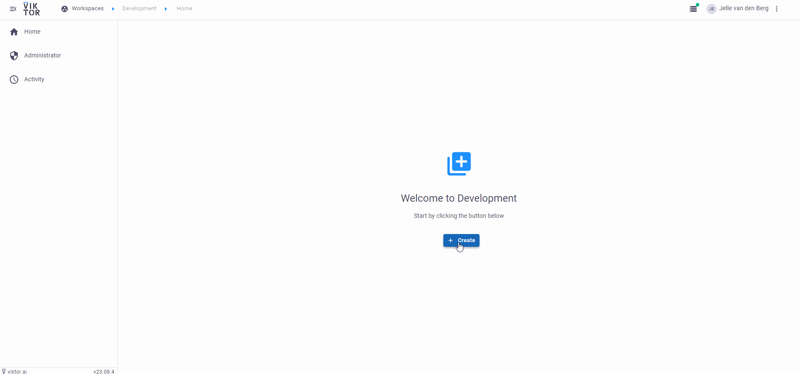
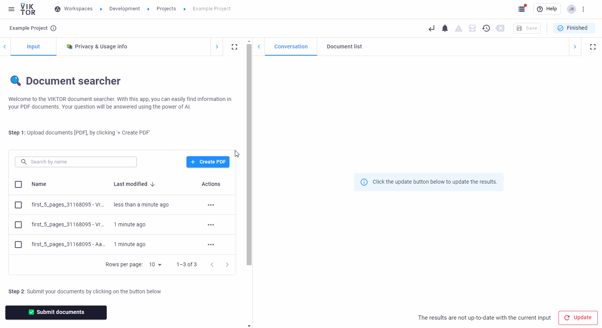

# LLM document search in VIKTOR
This app demonstrates how to create your own AI-powered VIKTOR app to search trough documents, using semantic search.

The app can be published and installed in your own VIKTOR environmnet directly and is ready to use. The app makes uses 
of the API from OpenAI (similar to what ChatGPT is running on). Additionally, Langchain is used to embed your documents,
 enabling search.

## Step 1: Upload and submit your data
Upload and submit your PDF documents. It is possible to submit multiple documents at once.

## Step 2: Search through your document(s)
Ask any question to your document(s). The question is answered making an API call to OpenAI. The relevant text from your 
document is shown in the sources. The question is answered based on the text in the sources, since the LLM cannot handle
 the entire document at once (due to the token limitation of any LLM model).

# App structure
This is a simple app type.
