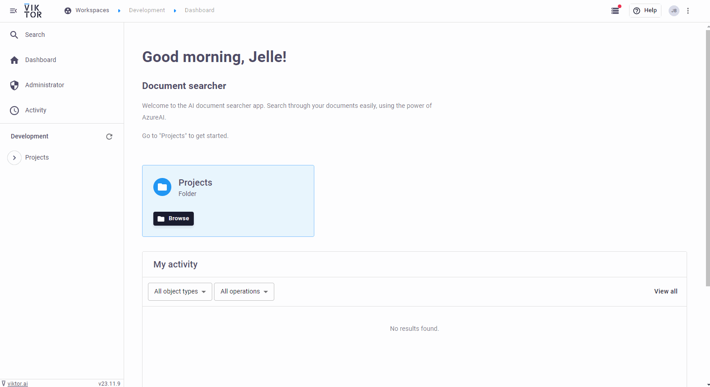

# Document searcher
This app demonstrates how to create your own AI-powered VIKTOR app to search through documents, using AzureAI.

The app can be published and installed in your own VIKTOR environment. The app makes uses 
of the API from AzureAI (similar to what ChatGPT is running on), ensuring your data is safe and is not used to train 
any model.

# Usage of the app
In the steps below is described how to use the app.

## Step 1: Upload PDF files
Upload your PDF documents. It is possible to submit multiple documents at once. The PDF files are processed 
automatically. Depending on the size of the document, this could take a while.

## Step 2: Submit documents
Click on the "Submit documents" button to collect all data from the uploaded PDF files.

## Step 3: Search through your document(s)
Ask any question to your document(s). The question is answered using AzureAI. The relevant text from your 
document is shown in the sources. The question is answered based on the text in the sources.

## Any language is supported
The app answers in the same language as the language of your question. Try it out yourself!

# Installation of the app
Simply install the app like any other VIKTOR application. Refer to the VIKTOR documentation of how this is done. 
Additionally, the AzureAI model needs to be hosted and set up. More information about how to set up your own AzureAI 
model, can be found on the [website of Microsoft](https://learn.microsoft.com/en-us/azure/ai-services/openai/quickstart?tabs=command-line%2Cpython&amp%3Bpivots=programming-language-python&pivots=programming-language-python).
The process is quite straighforward and should not take longer than 10-15 minutes.

For this application two models are required:

- Completion model. For example: gpt-3.5-turbo or gpt-4-turbo
- Embeddings model. For example: ada-2

Make sure the names of the models in your AzureAI environment resemble the names in the config.py file, referred to as COMPLETIONS_MODEL and EMBEDDINGS_MODEL.

Once the app is created, **three environment variables** need to be set: ENDPOINT, API_KEY and API_VERSION. Please refer to our [documentation](https://docs.viktor.ai/docs/create-apps/development-tools-and-tips/environment-variables/) 
for how to set up the environment variables in the app.

# Questions
For any questions about the app refer to our [community forum](https://community.viktor.ai/t/public-app-document-searcher-powered-by-chatgpt/1103). 
Feel free to ask any questions about the installation, usage or feature requests here!

# App structure
This is a tree type app.